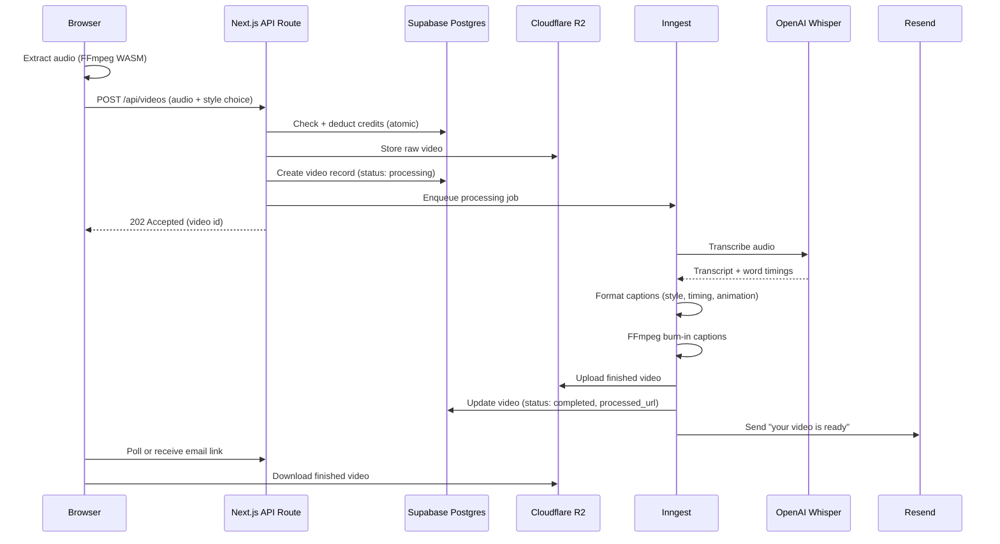

# CaptionCraft — Architecture

Companion to [PRD.md](./PRD.md). Covers the target architecture for the full product; the [ROADMAP.md](./ROADMAP.md) says what's built vs. planned.

## 1. Tech stack

| Layer | Technology | Status | Notes |
|---|---|---|---|
| Frontend | Next.js 16 (App Router) + React 19 + TypeScript + Tailwind CSS v4 | ✅ shipped | Landing page live |
| Animation | Framer Motion | ✅ shipped | |
| Icons | lucide-react | ✅ shipped | |
| Database | PostgreSQL via Supabase | ✅ shipped (waitlist table only) | See [Section 3](#3-database-schema) |
| DB access | `@supabase/supabase-js` (server-side, service-role client) | ✅ shipped | Direct client, no ORM — see [Section 2](#2-decision-no-orm-for-v1) |
| Auth | Supabase Auth (recommended) or Clerk (original plan) | ❌ not started | Decision needed before build phase, see [Section 4](#4-auth) |
| Video transcription | OpenAI Whisper API | ❌ not started | $0.006/minute |
| Video processing | FFmpeg WASM (client-side audio extraction) + FFmpeg (server-side burn-in) | ❌ not started | |
| File storage | Cloudflare R2 | ❌ not started | $0.015/GB/month |
| Payments | Stripe | ❌ not started | Subscriptions, 2.9% + 30¢/txn |
| Async jobs | Inngest | ❌ not started | Free to 50K events/month |
| Transactional email | Resend | ❌ not started | Free to 3K emails/month |
| Monitoring | Sentry + PostHog | ❌ not started | |
| Deployment | Vercel | ✅ shipped | |

## 2. Decision: no ORM for v1

The original plan specified Prisma. The waitlist feature that's already shipped uses `@supabase/supabase-js` directly against a hand-written `Database` type (see `app/lib/supabase-server.ts`), with schema changes applied as raw SQL in the Supabase SQL editor.

**Recommendation: stay ORM-free through the build phase.** Reasons:
- The schema in [Section 3](#3-database-schema) is small (6 tables) and won't churn fast enough to justify migration tooling overhead for a solo dev.
- Supabase's generated types (`supabase gen types typescript`) give most of Prisma's type-safety benefit without adding a dependency or a build step.
- Revisit this if the schema grows past ~10 tables or a second developer joins.

## 3. Database schema

Postgres via Supabase. `waitlist` is the only table that exists today; the rest is the target schema for the build phase.

```sql
-- Already shipped
create table public.waitlist (
  id uuid primary key default gen_random_uuid(),
  email text not null unique,
  created_at timestamptz not null default now()
);
alter table public.waitlist enable row level security;
-- no policies: only the service-role key (server-side) can write

-- Planned — build phase
create table public.users (
  id uuid primary key references auth.users(id) on delete cascade,
  email text not null unique,
  plan text not null default 'free',           -- free | starter | pro | business
  credits int not null default 20,
  stripe_customer_id text,
  created_at timestamptz not null default now()
);

create table public.videos (
  id uuid primary key default gen_random_uuid(),
  user_id uuid not null references public.users(id) on delete cascade,
  original_url text not null,
  processed_url text,
  status text not null default 'pending',      -- pending | processing | completed | failed
  style text not null,                         -- bold | neon | retro | cinematic | ...
  font text,
  animation text,                              -- word-by-word | none
  duration_seconds int,
  credits_used int not null default 1,
  created_at timestamptz not null default now()
);

create table public.captions (
  id uuid primary key default gen_random_uuid(),
  video_id uuid not null references public.videos(id) on delete cascade,
  text text not null,
  start_time numeric not null,
  end_time numeric not null
);

create table public.words (
  id uuid primary key default gen_random_uuid(),
  caption_id uuid not null references public.captions(id) on delete cascade,
  text text not null,
  start_time numeric not null,
  end_time numeric not null,
  confidence numeric
);

create table public.subscriptions (
  id uuid primary key default gen_random_uuid(),
  user_id uuid not null references public.users(id) on delete cascade,
  stripe_subscription_id text not null unique,
  status text not null,                        -- active | past_due | canceled
  plan text not null,
  current_period_end timestamptz not null
);

create table public.credit_transactions (
  id uuid primary key default gen_random_uuid(),
  user_id uuid not null references public.users(id) on delete cascade,
  amount int not null,                          -- negative for spend, positive for grant
  type text not null,                           -- signup_bonus | subscription_renewal | video_processed | refund
  video_id uuid references public.videos(id),
  description text,
  created_at timestamptz not null default now()
);
```

All tables get `alter table ... enable row level security;`. Because every write goes through server-side API routes using the service-role key (same pattern as `waitlist`), no per-table RLS policies are required for the app to function — RLS is enabled as defense-in-depth in case the anon/publishable key is ever used directly from the client.

## 4. Auth

The original plan (PRD Section 10) specified Clerk. Since the project already depends on Supabase for Postgres, **Supabase Auth** is the recommended alternative:

| | Clerk | Supabase Auth |
|---|---|---|
| Vendor count | +1 (on top of Supabase for DB) | 0 (same project) |
| Free tier | 10K MAU | 50K MAU |
| `users` table sync | Manual webhook to keep Clerk user in sync with app DB | `auth.users` is already in the same Postgres instance — `public.users.id` can FK directly to it |
| Effort | Slightly nicer prebuilt UI components | Slightly more manual UI, well-documented for Next.js App Router |

This doc defaults to Supabase Auth for the reasons above. If prebuilt polished auth UI matters more than vendor consolidation, Clerk remains a valid choice — flip this before Week 1 of the build phase, not mid-build.

## 5. System flow (video processing pipeline)



Target processing time: 30–90 seconds for a 60-second video.

## 6. Credit system

1 credit ≈ 1 video processed (flat rate for v1 — see [PRD.md open questions](./PRD.md#10-open-questions) on whether this should instead scale per-minute for longer videos).

| Plan | Credits/mo | Modeled API cost | Actual API cost (real usage) | Margin |
|---|---|---|---|---|
| Free | 20 | ~$0.24 | — | — (acquisition cost) |
| Starter | 100 | ~$1.20 | — | 92% |
| Pro | 500 | ~$6.00 | ~$2.40 (users rarely hit full quota) | 79% modeled / ~90% actual |
| Business | 2,000 | ~$24.00 | — | 70% |

Credit deduction must be an atomic transaction (check balance + deduct + create `credit_transactions` row in one DB transaction) to prevent race conditions from concurrent uploads draining more credits than available.

## 7. Environment variables (target, full build)

```bash
# Already in use
SUPABASE_URL=
SUPABASE_SERVICE_ROLE_KEY=
NEXT_PUBLIC_SUPABASE_URL=
NEXT_PUBLIC_SUPABASE_PUBLISHABLE_KEY=

# Auth (if Supabase Auth — no new vars needed beyond the above)
# Auth (if Clerk instead)
NEXT_PUBLIC_CLERK_PUBLISHABLE_KEY=
CLERK_SECRET_KEY=

# AI
OPENAI_API_KEY=

# Storage
CLOUDFLARE_R2_ACCESS_KEY_ID=
CLOUDFLARE_R2_SECRET_ACCESS_KEY=
CLOUDFLARE_R2_BUCKET=
CLOUDFLARE_R2_ENDPOINT=

# Payments
STRIPE_SECRET_KEY=
STRIPE_WEBHOOK_SECRET=
NEXT_PUBLIC_STRIPE_PUBLISHABLE_KEY=

# Queue
INNGEST_EVENT_KEY=
INNGEST_SIGNING_KEY=

# Email
RESEND_API_KEY=

# Monitoring
SENTRY_DSN=
NEXT_PUBLIC_POSTHOG_KEY=
```

## 8. API route map

| Route | Status | Purpose |
|---|---|---|
| `POST /api/waitlist` | ✅ shipped | Validates + inserts email into `waitlist` |
| `POST /api/videos` | ❌ planned | Accepts upload, deducts credit, stores in R2, enqueues job |
| `GET /api/videos/:id` | ❌ planned | Poll processing status |
| `POST /api/webhooks/stripe` | ❌ planned | Subscription lifecycle events |
| `POST /api/inngest` | ❌ planned | Inngest function handler (transcribe → format → burn-in → upload → notify) |

## 9. Why this stack (cost rationale)

The stack is chosen to keep fixed costs near zero and variable costs proportional to actual usage — no servers to provision, no GPU/model hosting. Full cost modeling lives in [COST-ANALYSIS.md](./COST-ANALYSIS.md).

## 10. Caption rendering engine (open question)

The original plan (Section 5) is hand-written FFmpeg drawtext filters per style, run server-side. An alternative surfaced during planning: use **HyperFrames** — an existing HTML/CSS-based video composition engine — as the rendering layer for Phase 3-4 instead.

**Why it's attractive:** HyperFrames' `embedded-captions` catalog ships ~32 distinct caption visual identities (matte-occlusion compositing, animated neon-sign strokes, glyph-decode reveals, etc.) with word-level timing and animation already built. That's a materially higher production ceiling than 6 hand-coded FFmpeg styles, for less custom animation code to write and maintain. It would also more directly deliver on the "word-by-word animation → 40% watch-time boost" feature already promised on the landing page, since that kind of animation is exactly what the engine is built for.

**What's unverified, and blocks committing to this:**
1. **Render cost and speed at SaaS volume.** HyperFrames has cloud/Lambda/Cloud-Run render paths per its CLI, which is promising, but actual $/video and seconds/video for this pipeline aren't known yet — they need to be benchmarked against the 30-90s target and the credit-economics model in [COST-ANALYSIS.md](./COST-ANALYSIS.md), which currently assumes near-zero rendering cost beyond Whisper.
2. **Content shape assumption.** Several of the catalog's identities rely on background-matting a single subject (talking-head framing). CaptionCraft's target content is mostly-but-not-exclusively talking-head; b-roll-heavy or multi-subject clips may not suit the matting-based styles even if the simpler overlay-style identities still work fine on any footage.

### 10.1 Feasibility spike — results (2026-07-24)

Ran a real, small-scale test rather than continuing to speculate: downloaded a short free-license clip (Mixkit), added an original synthetic narration track (no real audio in the stock clip), ran it through the actual `embedded-captions` pipeline locally on an M1 Pro (8-core, 16GB — not weak hardware).

- **Transcription (WhisperX, local, CPU):** did not finish transcribing an 11-second clip in over 4 minutes (25-30x+ realtime). Confirms the original architecture's choice of OpenAI's *hosted* Whisper API was correct — local/self-hosted transcription is not viable at the 30-90s/video target. **No change to Section 1's stack** — this validates it.
- **Matting (`remove-background`, u2net_human_seg):** benchmarked for real (below). Compute cost is small in dollars; the real constraint is wall-clock latency.

**Resulting architecture decision: rail vs. embed as a cost/pricing lever.** The `embedded-captions` engine itself distinguishes two caption modes:
- **Rail** (plain lower-third subtitle) — **no matting required at all**. Fast, cheap, no CPU-heavy step.
- **Embed** (word composited behind the subject) — requires the matting step measured below.

Given the measurement below, **rail should be the default rendering mode for all plans**, with embed-style (matting-based) captions reserved as a Pro/Business-tier or opt-in feature — not primarily because it's expensive in dollars (it isn't, see below), but because it's slow enough to need a different turnaround promise than the 30-90s target. This replaces the original assumption that all 6 (now up to ~32, via HyperFrames) styles cost the same to render — they don't, and pricing/plan gating should reflect that.

### 10.2 Matting benchmark — results (2026-07-24)

Built a full local checkout (`git clone heygen-com/hyperframes`, `bun install && bun run build`) and set `HYPERFRAMES_ROOT` so `remove-background` could actually run (the earlier `npx`-only attempt couldn't reach this step at all). Ran `u2net_human_seg` on the same 11.2s test clip (720p, 671 frames @ 60fps):

| Metric | Result |
|---|---|
| Wall-clock time | **145.9s** (~13x realtime) |
| CPU time | 416.9s user + 38.8s system = 455.7 CPU-seconds |
| Avg. CPU utilization | 312% (3+ cores) |
| Throughput | ~4.6 fps at 720p |
| Output quality | Clean segmentation on visual inspection; minor edge fringing traceable to the chroma-key source clip, not the tool |

**The important correction to make here: this is a latency problem, not a cost problem.** 455 CPU-seconds of compute is cheap in dollar terms on any serverless CPU pricing (low cents per video, same order of magnitude as everything else in [COST-ANALYSIS.md](./COST-ANALYSIS.md)) — nothing about matting threatens the margin model. What it threatens is the **30-90 second turnaround promise**: at ~13x realtime, a 60-second video would take on the order of **13 minutes** for the matting step alone on this single-instance, CPU-only, unparallelized setup — before render/composite/upload. That's fine for an async, email-notified flow (already the planned UX — see [Section 5](#5-system-flow-video-processing-pipeline)), but it means embed-mode needs its own, honestly-communicated turnaround estimate ("ready in a few minutes"), not the same promise as rail-mode.

**Ways to close the gap later, not decided yet:** horizontal parallelization (split frames across concurrent Lambda/Cloud Run invocations — wall-clock drops even though total compute-seconds stay similar), or simply keep embed-mode's slower turnaround as a permanent, disclosed characteristic of that tier rather than engineering around it.

**Still open:** this ran on a laptop, not the actual target cloud runtime — Lambda/Cloud Run cold-start and per-invocation pricing still need a real number before Phase 3 locks in a runtime choice.
